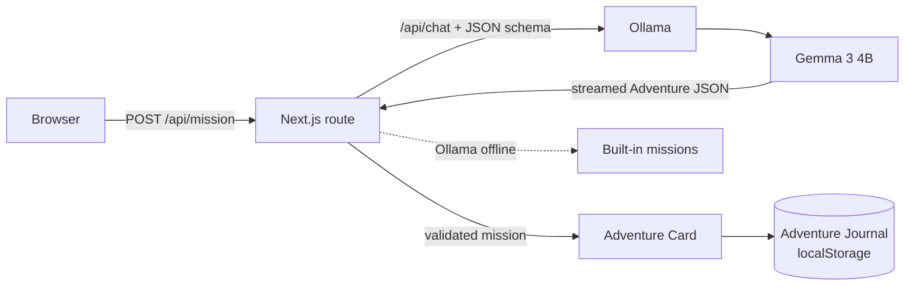

# 🌱 GrassMate

**AI that tells you to stop using AI.**

Create an outdoor adventure in seconds. Runs completely on your computer.

*Close your laptop. Go outside. Come back happier.*

GrassMate turns three quick choices (how much time you have, the weather and where you are) into a playful outdoor mission, written by **Gemma 3 4B running locally through Ollama**. You get a collectible Adventure Card, a calm nudge to close the laptop, and a reflection question when you come back, saved in your Adventure Journal.

Your data never leaves your machine: no account, no cloud API, no tracking.

Built for the Hacktoberfest 2026 Open-Source AI Challenge.

## Features

- **Generate Adventure:** pick 15 to 60 minutes, the weather and your environment (park, beach, forest, village or city).
- **🎲 Surprise Adventure:** one tap, and Gemma invents everything.
- **Adventure Card:** a named mission with difficulty, time, steps and a reward. It fills in live while Gemma writes it.
- **Go Outside screen:** "Adventure begins now. Close this laptop."
- **Reflection and Adventure Journal:** answer one question from Gemma when you return; entries are kept in your browser.
- **Streak and badges:** First Adventure, Explorer, Nature Lover and Seven-Day Streak.
- **Works offline:** if Ollama isn't running, GrassMate picks from 30 built-in missions.
- **Settings:** dark mode, default mission duration and mission theme.

## Architecture



Gemma returns one JSON object per mission, enforced with Ollama's structured outputs:

```json
{
  "emoji": "🌿",
  "title": "Leaf Hunter",
  "description": "Wander slowly and collect the shapes nature hides in plain sight.",
  "difficulty": "easy",
  "duration": 30,
  "steps": ["Find three different leaf shapes.", "Listen for five sounds.", "Sit quietly for five minutes."],
  "reward": "More curiosity.",
  "encouragement": "Tomorrow, try noticing something you walked past today.",
  "reflection": "What surprised you most during today's walk?"
}
```

## Getting started

You need [Node.js](https://nodejs.org) 20.9 or later and [Ollama](https://ollama.com) 0.6 or later.

```bash
ollama pull gemma3:4b      # about 3.3 GB, once
git clone https://github.com/bdhamithkumara/grassmate.git && cd grassmate
npm install
npm run build
npm start                  # http://localhost:3000
```

Use `npm start -- -p 3100` if port 3000 is taken. The production build uses far less memory than `npm run dev`.

## Configuration

Copy `.env.example` to `.env.local` to change any of these:

| Variable | Default | What it does |
| --- | --- | --- |
| `OLLAMA_HOST` | `http://127.0.0.1:11434` | Where Ollama runs |
| `OLLAMA_MODEL` | `gemma3:4b` | Model to use |
| `OLLAMA_NUM_GPU` | unset | Set to `0` to run on CPU only. Faster when a small GPU can hold only a few layers |
| `OLLAMA_NUM_THREAD` | unset | CPU threads; usually best left to Ollama |

## Performance on a low-end laptop

GrassMate is designed for modest hardware. Measured on an Intel Core i5-10210U (4 cores) with 16 GB RAM and `OLLAMA_NUM_GPU=0`:

| Step | Time |
| --- | --- |
| Model load (done in the background when the app opens) | about 20 s |
| First words of the card appear | about 11 to 13 s |
| Mission title shown | about 15 to 20 s |
| Complete mission | about 45 to 60 s |
| Offline fallback | instant |

Gemma uses about 2.9 GB of RAM while loaded and is unloaded after 5 idle minutes. Faster CPUs and GPUs are much quicker. On this machine, `OLLAMA_NUM_GPU=0` made generation about 25% faster than splitting the model with a 2 GB GPU.

## Development

```bash
npm run dev         # development server
npm test            # Vitest: validation, fallback, streaming preview, streaks, badges
npm run typecheck
```

```
app/
  page.tsx             screens and state
  components/          Home, AdventureCard, GoOutside, Reflection, Journal, Settings
  api/mission/         streams a mission from Ollama, falls back to built-ins
  api/health/          checks Ollama and warms the model up
lib/
  mission.ts           JSON schema and validation
  prompt.ts            the prompt sent to Gemma
  ollama.ts            Ollama client
  fallback.ts          30 built-in missions
  stream.ts            reads half-written JSON for the live card
  progress.ts          streaks and badges
  storage.ts           localStorage
tests/
```

## Privacy

Everything stays on your computer. The only network call GrassMate makes is to Ollama on `localhost`. Your journal, streak, badges and settings live in your browser's localStorage. Clearing site data removes them.

## License

[MIT](LICENSE)
